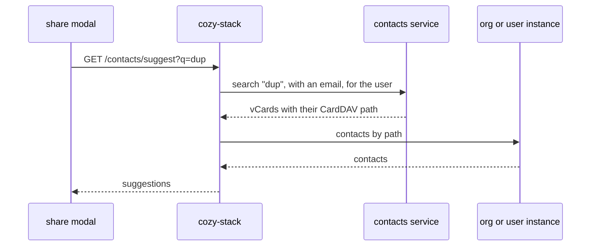

# ADR: Contact suggestions in the stack

## Status

Proposed

## Date

2026-09-14

## Context

Recipient suggestions in Drive have three problems:

1. They do not scale. The share modal [loads every contact and group](https://github.com/cozy/cozy-libs/blob/537656b7a2d55612500f7747d37707633d93dfa1/packages/cozy-sharing/src/components/ShareRecipientsInput.jsx#L35) of the instance each time it opens, [page by page](https://github.com/cozy/cozy-libs/blob/537656b7a2d55612500f7747d37707633d93dfa1/packages/cozy-sharing/src/queries/queries.js#L56), then [filters them in the browser](https://github.com/cozy/cozy-libs/blob/537656b7a2d55612500f7747d37707633d93dfa1/packages/cozy-sharing/src/components/ShareAutosuggest.jsx#L43). It only works because every member is copied to every instance, which is what the [storage ADR](https://github.com/linagora/cozy-stack/pull/4917) stops doing. Cached or not, an instance holding thousands of member documents so the browser can filter them is the problem.
2. They differ from the other apps. Mail and Calendar search their own index, Drive filters its local copy, so a colleague found in Mail can be missing in Drive.
3. There is no contact search route and no index on contact names, so the stack cannot answer instead of the client.

The [common contacts ADR](https://github.com/linagora/twake-workplace-private/pull/1608) already syncs contacts to every app through the `twake:contacts:common` exchange. [ADR 058](https://github.com/linagora/twake-workplace-private/pull/1640) adds a new contacts service with a search API shared by every app. This ADR describes how the stack uses that API. Where members and contacts are stored is covered by the [storage ADR](https://github.com/linagora/cozy-stack/pull/4917).

## Decision

- The stack adds a `GET /contacts/suggest` route, called by the share modal as the user types.
- The route calls the search API of the contacts service, asking only for people with an email, and maps each result to a contact document by its CardDAV path.
- In standalone mode (no contacts service, so no common contacts either), the route searches the org instance and the user's instance directly.



### The search API

The search is proposed in [twake-calendar-side-service#1061](https://github.com/linagora/twake-calendar-side-service/issues/1061): `POST /contacts/api/contacts/search?limit=&offset=` with a `query` and a list of address books. It searches each address book in Sabre, merges the results and returns one vCard per contact, with its CardDAV path in `_links.self.href`.

What the stack needs from it:

- A filter next to the text. Drive asks for "matches `dup` and has an email", and the service applies it before cutting to the top N. If the stack filters instead, the list comes up short: 30 results with 20 of them without an email leave 10 suggestions, and the next matches are never fetched.
- A way to search every address book the user can see (their own, the collected one, the domain one) without listing them. #1061 takes Sabre address book ids and user ids in the body, and the stack knows neither.
- It knows which user is searching. Results depend on who asks, and the bearer identifies the stack, not the user, so the stack names the user in a header.
- It takes the bearer of the stack's own OIDC client, one client per app ([ADR 058](https://github.com/linagora/twake-workplace-private/pull/1640)).
- Each result carries its CardDAV path, as #1061 does. From the vCard the stack only reads the name and the emails.
- Results come in the order to show them.
- It only returns people the user may see. The stack does not filter them again.

Each context configures the full URL of the search endpoint and the OIDC client of the stack:

```yaml
contexts:
  my-context:
    contacts_service:
      search_url: https://contacts-side-service.example.com/<search endpoint>
      client_id: cozy-stack
      client_secret: s3cret3
      token_url: https://identity-provider/path/to/token
```

A context without `contacts_service` is in standalone mode.

The stack stores the CardDAV path of every contact it receives ([storage ADR](https://github.com/linagora/cozy-stack/pull/4917)). It looks each result up by that path, on the org instance first, then on the user's instance. Where it is found gives its kind: a member on the org instance, a personal contact on the user's instance.

A contact the stack created at share time has no path until Sabre sends it back. When the path matches nothing, the stack tries the email with the `contacts-by-email` view.

A contact can have no email, and someone without one cannot be invited. With the filter the contacts service never returns them, and the standalone search applies the same rule. The share modal already hides them today, it only lists contacts with an email or a cozy URL.

### The route

`GET /contacts/suggest?q=<text>&limit=<n>` on the user's instance, with `GET` on `io.cozy.contacts`. `q` needs at least 3 characters and `limit` defaults to 20.

```json
{
  "data": [
    {
      "type": "io.cozy.contacts",
      "id": "6f2a",
      "attributes": {
        "fullname": "Jean Dupont",
        "email": [{ "address": "jean.dupont@org.tld", "primary": true }],
        "cozy": [{ "url": "https://jdupont.org.tld", "primary": true }]
      },
      "meta": { "kind": "member" }
    }
  ]
}
```

- Results keep the contacts service order.
- Attributes use the `io.cozy.contacts` field names, so cozy-sharing can render them as today.
- `meta.kind` is `member` or `contact`, depending on where the document was found.
- A result with no matching document comes back without an `id` or `kind`, with the name and email from the contacts service. The client shares it by email.

### Standalone mode

Without a contacts service, the stack runs a case-insensitive `$regex` Mango query on names and emails, on the org instance and the user's instance.

No existing index helps: `contacts-by-email` is an exact lookup, `by-groups` and `by-me` answer other reads, and a `$regex` cannot use an index anyway. So it stays a scan, which is fine on a standalone instance with few contacts.

## What changes for the clients

- cozy-sharing stops loading every contact and group, and calls `GET /contacts/suggest` as the user types (debounced, 3 characters minimum).
- cozy-sharing sends people as `{email}`. Today, when the typed email matches nothing, it [creates the contact itself](https://github.com/cozy/cozy-libs/blob/537656b7a2d55612500f7747d37707633d93dfa1/packages/cozy-sharing/src/helpers/contacts.js#L33) so the recipient has a document to point at. It stops, and the stack does it instead: it creates the contact, shares, publishes the address on `twake:contacts:collected`, then updates that document when Sabre sends it back ([storage ADR](https://github.com/linagora/cozy-stack/pull/4917)). Nothing waits on the contacts service.

## What to do when things fail

- Contacts service down or slow: after a short timeout, the route falls back to the standalone search and logs it.
- Org instance unreachable: members come back without an `id` and are shared by email.

## Consequences

- Opening the share modal no longer downloads the organization.
- Drive suggests the same people as the other apps.
- Suggestions depend on the contacts service being up.

## Open questions

- How does the stack ask for "has an email" in the #1061 request? @chibenwa
- Can the address books be left out of the request, to mean every address book the user can see? @chibenwa
- Which header names the user, and with which value (`internalEmail`)? @chibenwa
- Will groups be searchable, and how? [#1016](https://github.com/linagora/twake-calendar-side-service/issues/1016) adds contact lists with their members to people search. Do we display the whole group (one entry) or flatten the members list?
- What is the maximum `limit`, and what latency should the stack expect per keystroke?
- The modal shows a member count for groups, but neither a result nor the group document carries it. Do we drop it, or store a count on the group?
