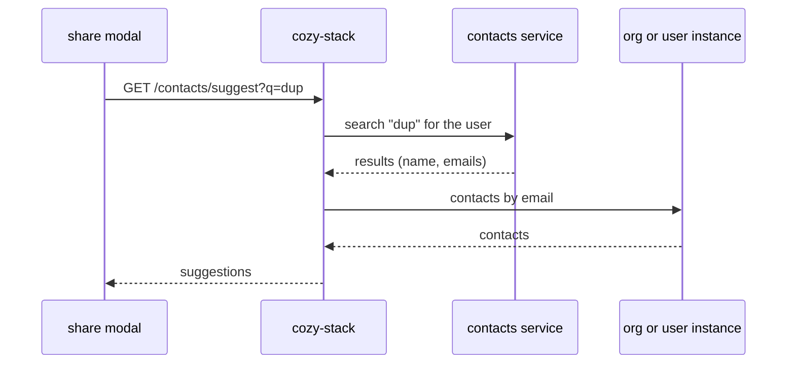

# ADR: Contact suggestions in the stack

## Status

Proposed

## Date

2026-09-14

## Context

Recipient suggestions in Drive have three problems:

1. They do not scale. The share modal [loads every contact and group](https://github.com/cozy/cozy-libs/blob/319c4890af0fbee641e25a2cb7c1bd2501b57024/packages/cozy-sharing/src/components/ShareRecipientsInput.jsx#L37) of the instance each time it opens, then [filters them in the browser](https://github.com/cozy/cozy-libs/blob/319c4890af0fbee641e25a2cb7c1bd2501b57024/packages/cozy-sharing/src/components/ShareAutosuggest.jsx#L43). In an organization of thousands of members, that is thousands of documents downloaded before the user types anything.
2. They differ from the other apps. Mail and Calendar search their own index, Drive filters its local copy, so a colleague found in Mail can be missing in Drive.
3. The stack cannot search. It has no contact search route and no index on contact names, so it cannot do the filtering itself.

The [common contacts ADR](https://github.com/linagora/twake-workplace-private/pull/1608) already syncs contacts to every app through the `twake:contacts:common` exchange. [ADR 058](https://github.com/linagora/twake-workplace-private/pull/1640) adds a new contacts service with a search API shared by every app. This ADR describes how the stack uses that API. Where members and contacts are stored is covered by the [storage ADR](https://github.com/linagora/cozy-stack/pull/4917).

## Decision

- The stack adds a `GET /contacts/suggest` route, called by the share modal as the user types.
- The route calls the search API of the contacts service and maps each result to a contact document by email.
- In standalone mode (no contacts service, so no common contacts either), the route searches the org instance and the user's instance directly.



### The search API

The contacts service will propose the API. What the stack needs from it:

- It knows which user is searching. Results depend on who asks (their personal contacts, the members of their organization), and the service token identifies the stack, not the user, so the stack names the user in a header.
- It accepts a service token, configured per context.
- Each result carries a display name and the emails.
- Results come in the order to show them.
- It only returns people the user may see. The stack does not filter them again.

Each context configures the full URL of the search endpoint and the token:

```yaml
contexts:
  my-context:
    contacts_service:
      search_url: https://contacts-side-service.example.com/<search endpoint>
      token: <service token>
```

A context without `contacts_service` is in standalone mode.

The stack looks each result up by email with the `contacts-by-email` view, on the org instance first, then on the user's instance. Where it is found gives its kind: a member on the org instance, a personal contact on the user's instance.

### The route

`GET /contacts/suggest?q=<text>&limit=<n>` on the user's instance, with `GET` on `io.cozy.contacts`. `q` needs at least 3 characters and `limit` defaults to 20.

```json
{
  "data": [
    {
      "type": "io.cozy.contacts",
      "id": "6f2a",
      "attributes": {
        "fullname": "Jean Dupont",
        "email": [{ "address": "jean.dupont@org.tld", "primary": true }],
        "cozy": [{ "url": "https://jdupont.org.tld", "primary": true }]
      },
      "meta": { "kind": "member" }
    }
  ]
}
```

- Results keep the contacts service order.
- Attributes use the `io.cozy.contacts` field names, so cozy-sharing can render them as today.
- `meta.kind` is `member` or `contact`, depending on where the document was found.
- A result with no matching document comes back without an `id` or `kind`, with the name and email from the contacts service. The client shares it by email.

### Standalone mode

Without a contacts service, the stack runs a case-insensitive `$regex` Mango query on names and emails, on the org instance and the user's instance.

## What changes for the clients

- cozy-sharing stops loading every contact and group, and calls `GET /contacts/suggest` as the user types (debounced, 3 characters minimum).
- cozy-sharing sends people as `{email}` and stops creating contacts before sharing.

## What to do when things fail

- Contacts service down or slow: after a short timeout, the route falls back to the standalone search and logs it.
- Org instance unreachable: members come back without an `id` and are shared by email.

## Consequences

- Opening the share modal no longer downloads the organization.
- Drive suggests the same people as the other apps.
- Suggestions depend on the contacts service being up.

## Open questions

- What does the search API look like: endpoint, request and response? @chibenwa
- Does it accept a service token, and which header names the user (with `internalEmail`)? @chibenwa
- Will groups be searchable, and how? Do we display the whole group (one entry) or flatten the members list?
- What is the maximum `limit`, and what latency should the stack expect per keystroke?
- The modal shows a member count for groups, but neither a result nor the group document carries it. Do we drop it, or store a count on the group?
