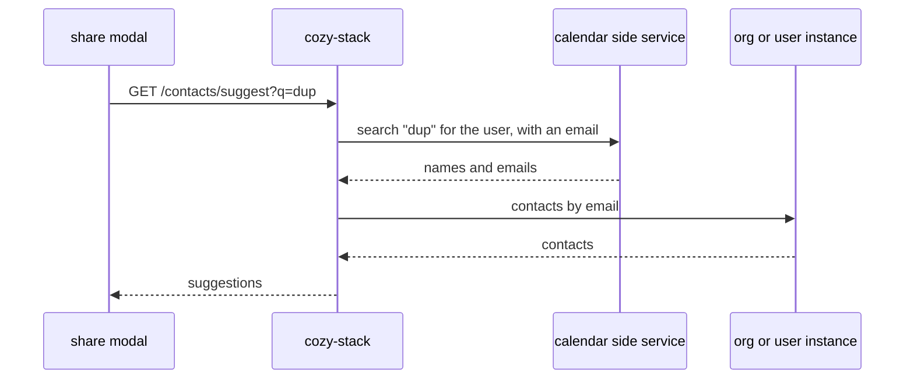

# ADR: Contact suggestions in the stack

## Status

Proposed

## Date

2026-09-14

## Context

Recipient suggestions in Drive have three problems:

1. They do not scale. The share modal [loads every contact and group](https://github.com/cozy/cozy-libs/blob/537656b7a2d55612500f7747d37707633d93dfa1/packages/cozy-sharing/src/components/ShareRecipientsInput.jsx#L35) of the instance each time it opens, [page by page](https://github.com/cozy/cozy-libs/blob/537656b7a2d55612500f7747d37707633d93dfa1/packages/cozy-sharing/src/queries/queries.js#L56), then [filters them in the browser](https://github.com/cozy/cozy-libs/blob/537656b7a2d55612500f7747d37707633d93dfa1/packages/cozy-sharing/src/components/ShareAutosuggest.jsx#L43). It only works because every member is copied to every instance, which is what the [storage ADR](006-adr-organization-contacts-storage.md) stops doing. Cached or not, an instance holding thousands of member documents so the browser can filter them is the problem.
2. They differ from the other apps. Mail and Calendar search their own index, Drive filters its local copy, so a colleague found in Mail can be missing in Drive.
3. There is no contact search route and no index on contact names, so the stack cannot answer instead of the client.

The [common contacts ADR](https://github.com/linagora/twake-workplace-private/pull/1608) already syncs contacts to every app through the `twake:contacts:common` exchange. [ADR 058](https://github.com/linagora/twake-workplace-private/pull/1640) puts an autocomplete API in the calendar side service, shared by every app. This ADR describes how the stack uses that API. Where members and contacts are stored is covered by the [storage ADR](006-adr-organization-contacts-storage.md).

## Decision

- The stack adds a `GET /contacts/suggest` route, called by the share modal as the user types.
- The route calls the autocomplete API of the calendar side service, asking only for people with an email, and maps each result to a contact document by email.
- In standalone mode (no calendar side service, so no common contacts either), the route searches the org instance and the user's instance directly.
- The route suggests people. Groups stay out of it: they remain the stack's own documents, built from `b2b.group.*`.


```mermaid
sequenceDiagram
  participant M as share modal
  participant S as cozy-stack
  participant C as calendar side service
  participant I as org or user instance

  M->>S: GET /contacts/suggest?q=dup
  S->>C: search "dup" for the user, with an email
  C-->>S: names and emails
  S->>I: contacts by email
  I-->>S: contacts
  S-->>M: suggestions
```

### The autocomplete API

The calendar side service exposes the autocomplete on a dedicated port, for backends only ([#1106](https://github.com/linagora/twake-calendar-side-service/issues/1106), [#1107](https://github.com/linagora/twake-calendar-side-service/pull/1107)). The stack sends:

```http
POST /api/people/search
Authorization: Bearer <secret>

{
  "user": "jean.dupont@org.tld",
  "q": "dup",
  "objectTypes": ["contact"],
  "hasFields": ["emailAddresses"],
  "limit": 20,
  "offset": 0
}
```

- `user` is the logged in user, by mail address. The bearer identifies the stack, not the person, so the stack names them here. It sends the `email` of the instance.
- `hasFields` leaves out the people without an email, before the service cuts to the top N. The stack cannot do that itself: of 30 results with 20 of them without an email, it would show 10 suggestions and never fetch the next matches.
- `matrixIds` and `phoneNumbers` come with [#1108](https://github.com/linagora/twake-calendar-side-service/issues/1108). The stack reads `emailAddresses` only.
- `limit` is between 1 and 256, and `offset` plus `limit` is at most 1000. The route's 20 fits.

A result carries an `id`, `names` and `emailAddresses`, in display name order, and no CardDAV path.

The search covers the organization address book, so a colleague comes up even when nobody has them in a personal address book.

Each context configures the endpoint and the shared secret:

```yaml
contexts:
  my-context:
    contacts_search:
      url: https://calendar-side-service.example.com:81/api/people/search
      token: abcdef
```

A context without `contacts_search` is in standalone mode.

So the stack looks each result up by email, with the `contacts-by-email` view, on the org instance first and then on the user's instance. Where it is found gives its kind: a member on the org instance, a personal contact on the user's instance.

A contact can have no email, and someone without one cannot be invited. `hasFields` keeps them out, and the standalone search applies the same rule. The share modal already hides them today, it only lists contacts with an email or a cozy URL.

### The route

`GET /contacts/suggest?q=<text>&limit=<n>` on the user's instance, with `GET` on `io.cozy.contacts`. `q` needs at least 3 characters and `limit` defaults to 20.

```json
{
  "data": [
    {
      "type": "io.cozy.contacts",
      "id": "6f2a",
      "attributes": {
        "fullname": "Jean Dupont",
        "email": [{ "address": "jean.dupont@org.tld", "primary": true }],
        "cozy": [{ "url": "https://jdupont.org.tld", "primary": true }]
      },
      "meta": { "kind": "member" }
    }
  ]
}
```

- Results keep the order of the search.
- Attributes use the `io.cozy.contacts` field names, so cozy-sharing can render them as today.
- `meta.kind` is `member` or `contact`, depending on where the document was found.
- A result with no matching document comes back without an `id` or `kind`, with the name and email from the search. The client shares it by email.

### Standalone mode

Without the calendar side service, the stack runs a case-insensitive `$regex` Mango query on names and emails, on the org instance and the user's instance.

No existing index helps: `contacts-by-email` is an exact lookup, `by-groups` and `by-me` answer other reads, and a `$regex` cannot use an index anyway. So it stays a scan, which is fine on a standalone instance with few contacts.

## What changes for the clients

- cozy-sharing stops loading every contact and calls `GET /contacts/suggest` as the user types (debounced, 3 characters minimum). It keeps reading the groups from the instance, so the group entries and their member count do not change.
- cozy-sharing sends people as `{email}`. Today, when the typed email matches nothing, it [creates the contact itself](https://github.com/cozy/cozy-libs/blob/537656b7a2d55612500f7747d37707633d93dfa1/packages/cozy-sharing/src/helpers/contacts.js#L33) so the recipient has a document to point at. It stops, and the stack does it instead: it creates the contact, shares, publishes the address on `twake:contacts:collected`, then updates that document when Sabre sends it back ([storage ADR](006-adr-organization-contacts-storage.md)). Nothing waits on the calendar side service.

## What to do when things fail

- Calendar side service down or slow: after a short timeout, the route falls back to the standalone search and logs it.
- Org instance unreachable: members come back without an `id` and are shared by email.

## Consequences

- Opening the share modal no longer downloads the organization.
- Drive suggests the same people as the other apps.
- Suggestions depend on the calendar side service being up.

## Open questions

- What latency should the stack expect per keystroke, so it can set its timeout? @chibenwa
