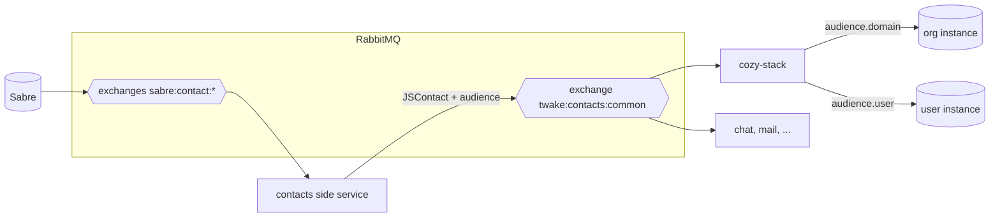
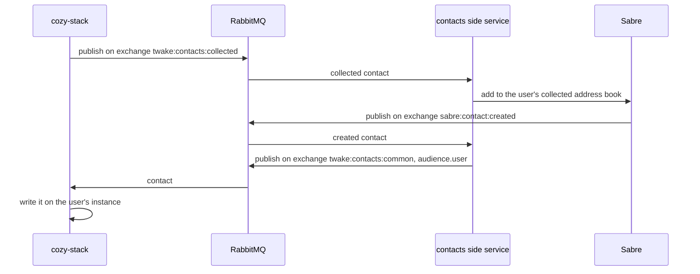

# ADR: Organization members and contacts storage

## Status

Proposed

## Date

2026-09-14

## Context

- Members are the users of the organization, from LDAP.
- Contacts are created by a user and are personal.
- The stack stores both as `io.cozy.contacts`, and today copies every member and group into every instance of the organization.

The [common contacts ADR](https://github.com/linagora/twake-workplace-private/pull/1608) makes Sabre the source of truth: apps read contacts from `twake:contacts:common` exchange and publish the ones they collect on `twake:contacts:collected` exchange.

Sharing reads contacts on the caller's instance to add recipients, to follow group changes and to auto accept. That breaks once members are no longer copied there.

## Decision

- Members live on the organization instance. Contacts live on the user's instance.
- With common contacts, the stack writes contacts only from `twake:contacts:common` exchange.
- Without common contacts (standalone), the stack keeps today's writers.
- Sharing accepts people by email and groups by id, looked up on the org instance first, then on the user's instance.

Instances without an `OrgID` are unchanged.

### Where members and contacts come from

`twake:contacts:common` is a `fanout` exchange with no routing key, so the stack receives every change for every user and domain. The message says what to do:

- `action`: `ADD`, `UPDATE` or `DELETE`. `ADD` and `UPDATE` carry the full contact, so replaying one changes nothing.
- `audience.domain`: a member, written on the org instance.
- `audience.user`: a personal contact, written on that user's instance.
- Empty audience: dropped.

Members reach the domain address book through the side service, which consumes `user.created` ([ADR 058](https://github.com/linagora/twake-workplace-private/pull/1640)). The member's cozy URL comes from `x-twake-workplace-fqdn` in the JSContact `vCardProps`.

A personal contact only names its owner by email, and the stack cannot find an instance from an email today. So the `user.created` handler stores `internalEmail` on the instance. It writes no contact anymore, and still sets the passphrase, the vault keys and the Matrix ID.

A document is keyed by its CardDAV `path`, because the same `uid` can sit in several address books.

### When a contact changes

- Updated: the stack overwrites it and keeps its own fields (`cozy` URL, `trustedForSharing`). Existing sharings keep the name and email they were created with.
- Removed: the stack deletes it. People shared with directly keep their access. People added through a group are removed from that group in the sharings using it.

### Sharing with an email

When the email matches a contact, on the org instance first, the member gets its name and instance URL.

When it matches nothing, the stack shares with the email, which sends an invitation, and collects the address:

The stack writes nothing itself: the contact comes back through `twake:contacts:common` exchange. In standalone mode, the stack creates the contact directly ( same as today ).

`twake:contacts:collected` is also a `fanout` exchange. The stack publisher refuses an empty routing key, so it needs a change. ( some refactor needed )

### Auto accept

A sharer is trusted when their instance has the same `OrgID` as the recipient. `trustedForSharing` stays for people outside the organization.

### Staying in sync

The side service can republish every address book. The stack replays it to fill an org instance or repair lost messages. Then it deletes the old copies on member instances with `BulkDeleteDocs`, so the `share-group` trigger does not revoke group members.

## Consequences

- A member change is one write instead of one per instance.
- Sharing between members depends on the org instance.

## Open questions

- Blocked contacts: what does blocking mean for the stack and drive? ( ignored for now )
- Groups: how do they reach `twake:contacts:common` (maybe as a label on the contact)? Until then, the stack keeps building them from `b2b.group.*`.
- When a member leaves a group, what happens to the sharings using it? Today the `share-group` trigger removes them.
- Existing group sharings use `b2b-group-<hash>` ids. How do they keep matching their groups?
- Domain groups can have thousands of members, and the stack reads at most 1000 per group, do we need to change that?
- A message delivered out of order can overwrite a newer contact until the next republication. we need to have some sort of revision id or time stamping from sabre?
