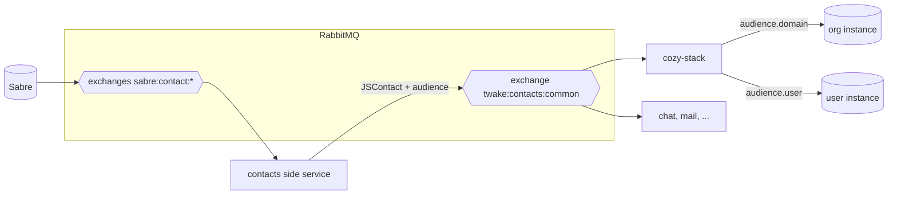
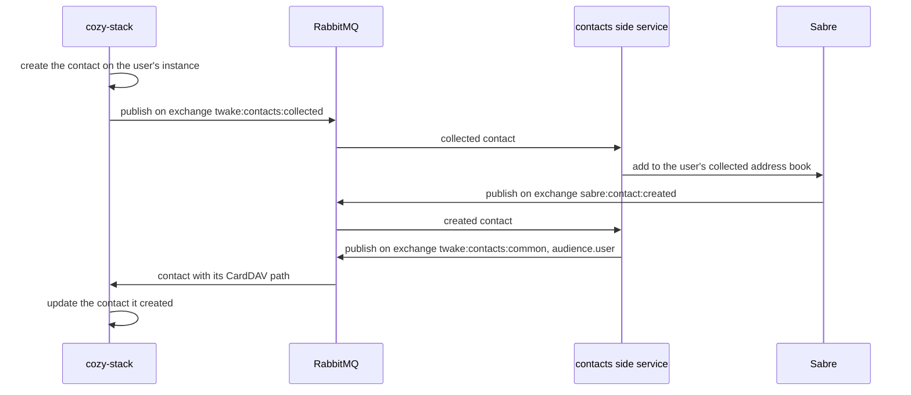

# ADR: Organization members and contacts storage

## Status

Proposed

## Date

2026-09-14

## Context

- Members are the users of the organization, from LDAP.
- Contacts are created by a user and are personal.
- The stack stores both as `io.cozy.contacts`, and today copies every member and group into every instance of the organization.

The [common contacts ADR](https://github.com/linagora/twake-workplace-private/pull/1608) makes Sabre the source of truth: apps read contacts from `twake:contacts:common` exchange and publish the ones they collect on `twake:contacts:collected` exchange.

Sharing reads contacts on the caller's instance to add recipients, to follow group changes and to auto accept. That breaks once members are no longer copied there.

## Decision

- Members live on the organization instance. Contacts live on the user's instance.
- With common contacts, contacts come from `twake:contacts:common` exchange. The stack still writes one itself when it needs it immediately (sharing with an unknown email, answering a sharing), and the feed updates it when it comes back.
- Without common contacts (standalone), the stack keeps today's writers.
- Sharing accepts people by email and groups by id, looked up on the org instance first, then on the user's instance.

Instances without an `OrgID` are unchanged.

### Where members and contacts come from

`twake:contacts:common` is a `fanout` exchange with no routing key, so the stack receives every change for every user and domain. The message says what to do:

- `action`: `ADD`, `UPDATE` or `DELETE`. `ADD` and `UPDATE` carry the full contact, so replaying one changes nothing.
- `audience.domain`: a member, written on the org instance.
- `audience.user`: a personal contact, written on that user's instance.
- Empty audience: dropped.

Members reach the domain address book through the side service, which consumes `user.created` ([ADR 058](https://github.com/linagora/twake-workplace-private/pull/1640)).

The contact comes as JSContact. The vCard properties JSContact does not cover stay in `vCardProps`, and the stack reads `x-twake-workplace-fqdn` there to fill the contact's `cozy` URL, the address sharing uses to reach that member's instance.

A personal contact only names its owner by email, and the stack cannot find an instance from an email today. So the `user.created` handler stores `internalEmail` on the instance. It writes no contact anymore, and still sets the passphrase, the vault keys and the Matrix ID.

Each message carries the CardDAV `path` of the contact: its address book and its file name. The stack stores that path and uses it to find which document the message is about. The `uid` is not enough, the same one can sit in several address books.

### When a contact changes

- Updated: the stack overwrites it and keeps its own fields (`cozy` URL, `trustedForSharing`). Existing sharings keep the name and email they were created with.
- Removed: the stack deletes the document. A recipient added by email keeps their access, the sharing already holds their name, email and instance. A recipient who is only there because of a group is removed from the sharings using that group, as today.

### Sharing with an email

This section is about who writes the contact document. Finding people to share with is the [suggestions ADR](https://github.com/linagora/cozy-stack/pull/4915).

When the email matches a contact, on the org instance first, the member gets its name and instance URL.

When it matches nothing, the stack creates the contact on the user's instance, shares with it, which sends an invitation, and collects the address:

The contact created at share time has no CardDAV path yet, it only holds the email. So for that first message the stack matches on the email and fills in the path, the name and the rest of the card. From then on the document is keyed by its path like any other.

Sharing never waits for any of this. The document exists before the invitation goes out, the publish is fire and forget, and a contacts service that is down changes nothing for the sharer: no rollback, no retry loop. The contact stays as the user typed it until Sabre answers.

The detour matters because Sabre is the source of truth: the address ends up in the user's collected address book, so the same contact reaches the other apps and not only the stack.

In standalone mode there is no feed, so the contact stays as the stack created it ( same as today ).

The document is not only a copy of Sabre. `trustedForSharing` and the `cozy` URL belong to the stack, and a message from the feed never overwrites them.

`twake:contacts:collected` is also a `fanout` exchange. The stack publisher refuses an empty routing key, so it needs a change. ( some refactor needed )

### Auto accept

A sharer is trusted when their instance has the same `OrgID` as the recipient. `trustedForSharing` stays for people outside the organization.

Answering a sharing is the other place where the stack writes a contact itself: it creates the sender's contact on the recipient instance and marks it trusted. That stays for people outside the organization. Between members, the `OrgID` decides and nothing is written.

### Staying in sync

The side service can republish every address book: every contact in Sabre is sent again as an `ADD`. The stack writes them like any other message, which fills a new org instance or fixes contacts it missed. Then it deletes the old copies on member instances with `BulkDeleteDocs`, so the `share-group` trigger does not revoke group members.

A republication repairs a lost `ADD` or `UPDATE`, not a lost `DELETE`. To catch those, the stack wants a periodic reconciliation on the org instance: compare what Sabre sends with what the instance holds, and remove the rest. That needs the republication to be a full set the stack can trust, which is the open question below.

## Consequences

- A member change is one write instead of one per instance.
- Sharing between members depends on the org instance.

## Open questions

- Blocked contacts: what does blocking mean for the stack and drive? ( ignored for now )
- What identifies a contact and a group outside the stack? The stack uses the CardDAV path for contacts, and groups have no equivalent yet. Do we keep the CouchDB ids we have today, or do we key both on an id coming from the source? @shepilov
- A sharing created on a personal instance points at a group that now lives on the org instance. How do we move those sharings, and how do they keep following the group? @shepilov
- Groups: how do they reach `twake:contacts:common` (maybe as a label on the contact)? Until then, the stack keeps building them from `b2b.group.*`.
- When a member leaves a group, what happens to the sharings using it? Today the `share-group` trigger removes them.
- Existing group sharings use `b2b-group-<hash>` ids. How do they keep matching their groups?
- Domain groups can have thousands of members, and the stack reads at most 1000 per group, do we need to change that?
- A message delivered out of order can overwrite a newer contact until the next republication. we need to have some sort of revision id or time stamping from sabre?
- A missed `DELETE` is not repaired: the republication only sends `ADD`, so a contact deleted in Sabre stays in the stack. Does the side service need a full sync mode, or does the stack remove contacts that a republication did not send?
