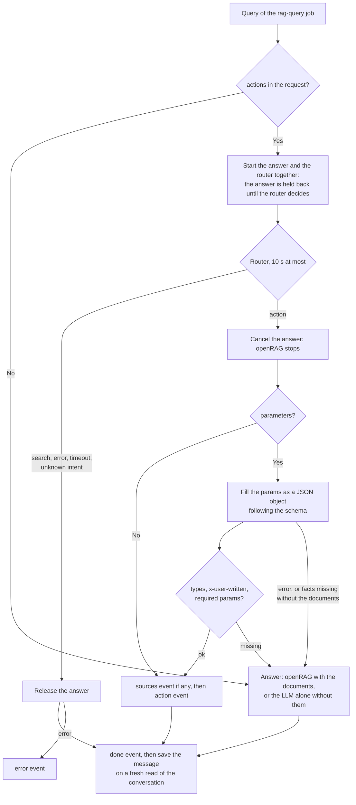

[Table of contents](README.md#table-of-contents)

# AI for personal data

## Introduction

AI can be used for interacting with the personal data of a Cozy. This is
currently an experimental feature. Retrieval-Augmented Generation (RAG) is
a classical pattern in the AI world. Here, it is specific to each Cozy.


## Indexation

First of all, the RAG server must be installed with its dependencies. It is
not mandatory to install them on the same servers as the cozy-stack. And the
URL of RAG must be filled in cozy-stack configuration file (in `rag`).

The indexing follows the assistants: every `io.cozy.ai.chat.assistants`
document whose `knowledgeBase` has an `io.cozy.files` entry defines a folder
to index. The files of that folder (recursively) are sent to the openRAG
server and attached to the workspace named after the folder id; the
assistant's retrieval is scoped to that workspace.

openRAG indexes an upload asynchronously: while the task runs, it still
answers 404 on the file but refuses a second POST with a 409. The worker then
sends the file again with a PUT, which re-indexes the content, instead of
failing on the conflict.

openRAG also deduplicates by content: a partition holds one document per
distinct content, and an upload whose content is already indexed under
another file id is refused with a 409 `DOCUMENT_CONTENT_EXISTS`. The worker
logs that file once (with the id of the document already holding the content)
and skips it for good: it is not indexed, and not attached to any workspace,
so a search hit points at the other copy. A reconcile of its folder does not
change that — the second copy is refused again, and only counted in the
summary of the walk.

The `rag-index` worker does all of this in one job per instance, reading the
changes feed of `io.cozy.files` from a checkpoint. It is woken up by two
`@event` triggers, created by the app in charge of the assistants (the worker
is not reserved, an app token with the `io.cozy.triggers` permission is
enough):

```json
{ "data": { "attributes": {
  "type": "@event", "arguments": "io.cozy.files", "debounce": "30s",
  "worker": "rag-index", "message": { "doctype": "io.cozy.files" } } } }
```

```json
{ "data": { "attributes": {
  "type": "@event", "arguments": "io.cozy.ai.chat.assistants",
  "worker": "rag-index", "message": { "doctype": "io.cozy.files" } } } }
```

The second trigger only wakes the worker when an assistant is created,
modified or deleted: the worker then creates the workspace of a new folder
and pushes a job that walks its subtree (in that order: nothing is indexed
into a workspace that does not exist, and a workspace whose job could not be
pushed is deleted again, so the next run retries both), or removes the
workspace of a folder no assistant uses any more (its files are deleted from
openRAG when no other folder contains them).

A chat on an assistant whose folder has no workspace yet (the job did not run
since the assistant was created) fails with an error event saying the
knowledge base is not indexed; it works once the job ran.

By default, only text-based files are indexed. Images, videos, and audio files
can be indexed by enabling the following feature flags:

- `rag.index.image.enabled`
- `rag.index.video.enabled`
- `rag.index.audio.enabled`

### Operator tools

The admin API exposes them (see [admin.md](admin.md) for the details):

- `POST /instances/:domain/rag/reset` deletes the checkpoint and launches the
  indexing: the whole changes feed is scanned again. It is the recovery when
  changes were skipped for good, i.e. when a batch was given up on after too
  many attempts (typically after a long openRAG outage) and the files it held
  did not change since, and the way to launch the indexing right after a purge.
- `POST /instances/:domain/rag/reconcile?dir_id=<id>` re-indexes the subtree
  of one knowledge base folder (without `dir_id`, of all of them).
- `POST /instances/:domain/rag/prune` deletes from openRAG the files no
  knowledge base folder claims and the workspaces of folders no assistant uses.
- `POST /instances/:domain/rag/purge` deletes everything openRAG holds for the
  instance (files, workspaces, partition) and the checkpoint.

A reconcile job skips the files openRAG refuses for good (an unsupported
format, say); a file whose content is missing from the storage is skipped as
well, since it will not come back: each one is logged and the walk goes on,
so only transient errors (network, 5xx) fail the job and have the worker walk
the folder again.
A skipped file stays unindexed until it changes, or until an operator re-walks
its folder with `POST /instances/:domain/rag/reconcile?dir_id=<id>`.

None of these routes is called by the stack itself: they are for an operator
(the jobs pushed by the triggers, and the workspace reconciliation they start
with, cover the normal course of things).

Recovery: an initial indexing that did not finish (the job of a very large
folder, a whole-Drive assistant typically, hit the worker timeout) is
restarted with `POST /instances/:domain/rag/reconcile?dir_id=<id>`; nothing
else replays it, since the files of the folder did not change. Removing a
whole-Drive workspace is also much cheaper with the prune route, which
makes one pass over openRAG's file list, than through the automatic detach of
the workspace diff, which walks the subtree file by file. Note that prune and
purge do not take the lock the indexing jobs use: run them when no rag-index
job is running.

A trigger can still be created by hand with a CLI token:

```sh
$ COZY=cozy.localhost:8080
$ TOKEN=$(cozy-stack instances token-cli $COZY io.cozy.triggers)
$ curl "http://${COZY}/jobs/triggers" -H "Authorization: Bearer $TOKEN" -d '{ "data": { "attributes": { "type": "@event", "arguments": "io.cozy.files", "debounce": "30s", "worker": "rag-index", "message": {"doctype": "io.cozy.files"} } } }'
```

### POST /ai/index/status

The RAG indexer reports the indexation status of a document on this route. The
status is saved on an `io.cozy.ai.chat.rag` document whose identifier is the
identifier of the document it describes. Only files are indexed for now.

This route has no authentication yet.

#### Request

```http
POST /ai/index/status HTTP/1.1
Host: alice.example.net
Content-Type: application/json
```

```json
{
  "partition": "alice.example.net",
  "file_id": "e21dce8058b9013d800a18c04daba326",
  "status": "success",
  "metadata": {
    "doc_rev": "3-6a1b0b8a51a4e0e0a3b7f0f1d2c3b4a5",
    "datetime": "2026-08-20T08:12:00.000Z",
    "created_at": "2026-08-20T08:12:03.512Z",
    "doctype": "io.cozy.files"
  }
}
```

The `status` can be `success`, `error` or `notsupported`. The `doc_rev` is the
revision of the document the status is about, as it was given to the indexer. It
is mandatory: callbacks are ordered on it, and a callback that carries none
cannot be placed. It is saved on the status document as `docRev`, so that a
client can tell whether the current revision of the document is the one
described.

The indexer echoes back more than `doc_rev`, but the other fields are ignored.

#### Response

```http
HTTP/1.1 204 No Content
```

A callback is answered with a `400 Bad Request` when its payload is invalid or
when its partition is not this instance, and with a `500 Internal Server Error`
when the status could not be saved.

A callback about a revision older than the one already saved is accepted but not
saved, and answered with a `204`. One about the same revision describes the same
indexation and is saved.

## openRAG

Some openRAG API are directly exposed through cozy-stack.
Note the JSON-API format is not used here as we follow the openRAG format.

### POST /ai/v1/chat/completions

This route directly follows the [openAI chat completion AI](https://platform.openai.com/docs/api-reference/chat/create).

#### Request

```http
POST /ai/v1/chat/completions HTTP/1.1
Content-Type: application/json
```

```json
{
  "messages": [
    { "role": "user", "content": "Hello there, what's in your mind?" }
  ],
  "temperature": 0.3
}
```

#### Response

```http
HTTP/1.1 200 OK
Content-Type: application/json
```

```json
{
  "id": "chatcmpl-43036e48fbac40fead606e8692a7b408",
  "created": 1763657211,
  "model": null,
  "object": "chat.completion",
  "system_fingerprint": null,
  "choices": [
    {
      "finish_reason": "stop",
      "index": 0,
      "message": {
        "content": "As an artificial intelligence language model, I don't have personal thoughts or emotions like humans do. My purpose is to assist and provide information to the best of my abilities based on the data I have been trained on. Is there something specific you would like to know or discuss?",
        "role": "assistant",
        "tool_calls": null,
        "function_call": null
      }
    }
  ],
  "usage": {
    "completion_tokens": 56,
    "prompt_tokens": 28,
    "total_tokens": 84,
    "completion_tokens_details": null,
    "prompt_tokens_details": null
  },
  "service_tier": null,
  "prompt_logprobs": null,
  "extra": { "sources": [] }
}
```

The response is openRAG's own: up to openRAG v2.2.0 (legacy), `extra` is a
JSON-encoded string (`"{\"sources\": []}"`) and the metadata of a document
source is flat instead of nested under `chunk`.

### POST /ai/v1/tools/execute

This route directly calls the [openRAG](https://github.com/linagora/openrag) tools API.

#### Request

POST /ai/v1/tools/execute HTTP/1.1
Content-Type: multipart/form-data

```
file=<file content>
tool={"name": "extractText"}
metadata={"mime":"application/pdf","name":"myfile.pdf"}
```

#### Response

```http
HTTP/1.1 200 OK
Content-Type: application/json
```

```json
{
  "message": "Some file content"
}
```


## Assistant chat

When a user starts a chat from the assistant, their prompts are sent to the RAG that can use the
vector database to find relevant documents (technically, only some parts of
the documents called chunks). Those documents are added to the prompt, so
that the LLM can use them as a context when answering.

### POST /ai/chat/conversations/:id

This route can be used to ask AI for a chat completion. The id in the path
must be the identifier of a chat conversation. The client can generate a random
identifier for a new chat conversation.

The stack will respond after pushing a job for this task, but without the
response. The client must use the real-time websocket and subscribe to
`io.cozy.ai.chat.events`.

#### Request

```http
POST /ai/chat/conversations/e21dce8058b9013d800a18c04daba326 HTTP/1.1
Content-Type: application/json
```

```json
{
  "q": "Why the sky is blue?",
  "stream": true,
  "websearch": false,
  "documents": true,
  "instructions": "The answer is put in a document as it is: no introduction, no comment.",
  "assistantID": "abc123",
  "attachmentIDs": ["827f0fbb928b375cc457c732a4013aa7", "9a3b1c2d3e4f5a6b7c8d9e0f1a2b3c4d"],
  "actions": [
    {
      "name": "create_note",
      "description": "write a note in the user's Notes app: a summary of the conversation, a list of tasks, a short text on a subject.",
      "examples": ["Make a note of it"],
      "parameters": {
        "type": "object",
        "properties": {
          "title": { "type": "string", "description": "the title of the note" },
          "content": { "type": "string", "description": "the note itself, in Markdown, without its title" }
        },
        "required": ["title", "content"]
      },
      "instructions": "A note is concise: organize it with short \"##\" sections or lists."
    }
  ]
}
```

- `q` is the user's message (required).
- `stream` enables streaming the response via SSE deltas (defaults to `true`).
- `websearch` enables web search for the query (defaults to `false`).
- `documents` (defaults to `true`): when `false`, the LLM answers the
  conversation by itself, without searching the user's documents, whatever the
  knowledge base of the assistant: the answer has no sources. For a client
  that gives the LLM all it needs in the message, like a text to translate or
  to fix. `websearch` still applies. It cannot be used with `attachmentIDs`,
  which are read from the documents: the message is rejected with a
  `400 Bad Request`. An action is made the same way, see
  [chat actions](#chat-actions).
- `instructions` (optional, at most 2000 characters) tell the LLM how to
  answer in this client, e.g. that the answer is put in a document as it is.
  They are sent as a `system` message with the answer, after the prompt of
  the assistant, with or without the documents; with them, openRAG splices
  them into its own system prompt, like the prompt of an assistant. They are
  not saved in the conversation: the client sends them with each message
  they apply to. They are inspired by the `instructions` of the
  [OpenAI Responses API](https://platform.openai.com/docs/api-reference/responses/create),
  which are not carried over to the next answers either.
- `assistantID` (optional) associates the conversation with an `io.cozy.ai.chat.assistants`
  document. When set, the response includes a `relationships` block.
  When the assistant has a knowledge base folder, the retrieval is scoped to
  that folder's workspace. The assistant's folder must have been indexed at
  least once by the `rag-index` worker; otherwise the query fails with an
  error event saying the knowledge base is not indexed.
  When the assistant has a `prompt`, it is sent to openRAG with every query
  of the conversation, as a leading `system` message that openRAG splices
  into its own system prompt (flagged as untrusted instructions). The prompt
  is read from the assistant document at query time, not saved in the
  conversation: editing it on the assistant applies to its existing
  conversations as well.
- `attachmentIDs` (optional) array of ids, specifying which documents should be leveraged by the RAG.
- `actions` (optional) the definitions of the [chat actions](#chat-actions)
  the client can run. Without it, the message is answered as usual, without
  a router. Invalid definitions are rejected with a `400 Bad Request`.

#### Response

```http
HTTP/1.1 202 Accepted
Content-Type: application/vnd.api+json
```

```json
{
  "data": {
    "type": "io.cozy.ai.chat.conversations",
    "id": "e21dce8058b9013d800a18c04daba326",
    "rev": "1-23456",
    "attributes": {
      "messages": [
        {
          "id": "eb17c3205bf1013ddea018c04daba326",
          "role": "user",
          "content": "Why the sky is blue?",
          "attachmentIDs": ["827f0fbb928b375cc457c732a4013aa7", "9a3b1c2d3e4f5a6b7c8d9e0f1a2b3c4d"],
          "createdAt": "2024-09-24T13:24:07.576Z"
        }
      ],
      "relationships": {
        "assistant": {
          "data": {
            "id":"b2e1a4144c123ec694697d996102983a",
            "type":"io.cozy.ai.chat.assistants"
          }
        }
      },
      "cozyMetadata": {
        "createdAt": "2024-09-24T13:24:07.576Z",
        "createdOn": "http://cozy.localhost:8080/",
        "doctypeVersion": "1",
        "metadataVersion": 1,
        "updatedAt": "2024-09-24T13:24:07.576Z"
      }
    }
  }
}
```

### Real-time via websockets

#### Messages flow example

```
client > {"method": "AUTH", "payload": "token"}
client > {"method": "SUBSCRIBE",
          "payload": {"type": "io.cozy.ai.chat.events"}}
server > {"event": "CREATED",
          "payload": {"id": "eb17c3205bf1013ddea018c04daba326",
                      "type": "io.cozy.ai.chat.events",
                      "doc": {"object": "delta", "content": "The ", "position": 0}}}
server > {"event": "CREATED",
          "payload": {"id": "eb17c3205bf1013ddea018c04daba326",
                      "type": "io.cozy.ai.chat.events",
                      "doc": {"object": "delta", "content": "sky ", "position": 1}}}
[...]
server > {"event": "CREATED",
          "payload": {"id": "eb17c3205bf1013ddea018c04daba326",
                      "type": "io.cozy.ai.chat.events",
                      "doc": {"object": "sources", "content": [{"id": "827f0fbb928b375cc457c732a4013aa7", "doctype": "io.cozy.files"}]}}}
server > {"event": "CREATED",
          "payload": {"id": "eb17c3205bf1013ddea018c04daba326",
                      "type": "io.cozy.ai.chat.events",
                      "doc": {"object": "done"}}}
```

#### Action message

When the stack proposes a [chat action](#chat-actions), an `action` event
comes before the `done` one. `message_id` is the id of the assistant message
the action is saved on. The message is saved right after the `done` event, as
without an action: a client that does not find it in the conversation yet
waits for the conversation to be updated. The events of a message are, in
order:

- a search: `delta` events, `sources` if any, `done`;
- an action: `sources` if any, when its params are filled with the documents,
  then `action`, `done`.

```
server > {"event": "CREATED",
          "payload": {"id": "eb17c3205bf1013ddea018c04daba326",
                      "type": "io.cozy.ai.chat.events",
                      "doc": {"object": "action",
                              "message_id": "0192f0a5-4d8b-7c1e-9a3f-1b2c3d4e5f60",
                              "action": {"name": "draft_email",
                                         "params": {"to": ["Paul"], "subject": "Groceries", "body": "Hi Paul, ..."}}}}}
server > {"event": "CREATED",
          "payload": {"id": "eb17c3205bf1013ddea018c04daba326",
                      "type": "io.cozy.ai.chat.events",
                      "doc": {"object": "done"}}}
```

#### Error message

If an error occurs while processing the AI response (e.g. the LLM is
unavailable), an error event is sent instead:

```
server > {"event": "CREATED",
          "payload": {"id": "eb17c3205bf1013ddea018c04daba326",
                      "type": "io.cozy.ai.chat.events",
                      "doc": {"object": "error", "message": "I don't want to talk today"}}}
```

### Chat actions

The assistant can propose an action of the client instead of a plain answer,
like writing a note or drafting an email. The client defines its actions in
the request; the stack knows nothing of them but these definitions. It never
runs an action: the client shows it to the user, who can edit it, and runs it
once the user has confirmed it.

An action definition has:

- `name` (required): the identifier of the action, which also names the JSON
  schema of its params for the LLM: 1 to 64 letters, digits, `_` or `-`, the
  rule of the OpenAI API for such a name. `search` is reserved, whatever the
  case.
- `description` (required): what the action does, and when to pick it. It is
  given to the router, and to the LLM that fills the params.
- `examples` (optional): messages for which the router picks the action.
- `parameters` (optional): the JSON schema of the params the LLM fills, like
  the `parameters` of a tool for function calling: an `object` whose
  `properties` are strings, or arrays of strings, with a `description`. The
  other keywords of JSON schema are ignored. Every param of the schema is
  present in the action, `""` or `[]` when unknown. An action without
  parameters is proposed as soon as the router picks it, without a call to
  the LLM. `required` lists the params without which the action is not
  proposed. `facts_missing` is reserved. A property with
  `"x-user-written": true` keeps only the values found, as whole words and
  whatever the case, in the messages of the user, as the user wrote them, so
  that the content of a document cannot add one, like the recipient of an
  email. A document pasted in a message counts as written by the user. The
  other params carry what the conversation and the documents say, links
  included: the client shows them to the user for review.
- `instructions` (optional): how to fill the params, like the format of a
  text.

A note or a document is an action like any other, with params like `title`
and `content`, the content in the format the client asks for in the
instructions, like Markdown.

The stack sets no limit of its own on the number or the size of the
definitions. They go into the prompts of the LLM with every message: the
longer they are, the slower the router. When they do not fit the context of
the model, openRAG refuses the query and the message is answered as a search.

```json
{
  "name": "draft_email",
  "description": "prepare an email for the user to review and send: a reply, a message to someone, a summary to share.",
  "examples": ["Write an email to the team about the delivery delay"],
  "parameters": {
    "type": "object",
    "properties": {
      "to": {
        "type": "array",
        "items": { "type": "string" },
        "description": "the recipients, as the user named them (names or email addresses)",
        "x-user-written": true
      },
      "subject": { "type": "string", "description": "the subject of the email" },
      "body": { "type": "string", "description": "the text of the email" }
    },
    "required": ["subject", "body"]
  },
  "instructions": "The body is plain text, ready to send, with a greeting and a sign-off."
}
```

#### How a message is answered

Two things decide what happens to a message with `actions`, and nothing else
is guessed:

- **The user chooses the documents.** `documents` (`true` by default) says
  whether the answer uses the user's documents. With them, the stack goes
  through openRAG, which retrieves what the conversation needs, or nothing
  when its query step finds the turn conversational. Without them, it asks
  the LLM behind openRAG alone. The params of an action are filled exactly
  the way the answer would have been made.
- **The router chooses the intent.** The LLM of the assistant is asked,
  without retrieval and with a JSON schema, one closed question: is the last
  message a `search`, or one of the actions? It reads the last message and
  the exchange before it, which a message like "make a note of it" refers
  to.

The router is not asked whether the documents are needed: a small LLM cannot
tell, and makes up the facts of the user's organization when it writes
without them, while a search of the documents to check it matches any message
sharing a word with one of them. openRAG already decides the retrieval of
every answer.

The answer starts at the same time as the router and is held back until the
router has decided, which is usually before its first token. The router has
10 seconds, since the answer waits for it. For a search, the answer is
released. For an action, the answer is cancelled, which stops it on openRAG
with `stream: true` (the default; without streaming, openRAG finishes it for
nobody), and the params of the action are filled:



Below, "openRAG" means `POST /v1/chat/completions` with the partition of the
instance as the model: retrieval in the workspace of the assistant or in the
attachments, then the LLM with the retrieved chunks. "The LLM alone" means the
same route without a model: no retrieval, the messages as they are. The events
of each case are listed in [Action message](#action-message).

| Router says | `documents` | What is made, by whom | Saved message |
|---|---|---|---|
| `search` | true | The answer, by openRAG | content = the answer, its sources |
| `search` | false | The answer, by the LLM alone | content = the answer |
| an action | true | The params, by openRAG: the conversation with the fill instructions as a last leading system message, after the prompt of the assistant and the instructions of the client, and the schema of the params as `response_format` | content empty, the sources of the documents used, action = `{params}` |
| an action | false | The params, by the LLM alone: the fill instructions, the quoted transcript of the conversation, the schema | content empty, action = `{params}` |

The fill instructions give the LLM the description and the instructions of
the action, the params with their descriptions, today's date, and rules: `""`
or `[]` for a field it cannot fill, no fact, name or email address of the
user's organization that the conversation or the documents do not give, no
placeholder like `[Name]`, but what it knows of a general subject, like a
method or a notion.

Without the documents, the LLM is told that it does not know the user's
organization, and it fills a `facts_missing` boolean with the params: true
when they need facts of the user's organization or work, like its projects,
decisions, clients, contacts or rules, that the conversation does not give.
The message is then answered instead, by the LLM alone. A schema forces the
LLM to fill the params, and without this way out, it invents such facts. The
stack removes `facts_missing` from the params. With the documents, openRAG
gives the LLM what they say of the subject, and the field is not asked.

The router is given the last exchange, and the params made without the
documents the whole conversation, quoted message by message, and nothing
else. The prompt of the assistant, the `instructions` of the client,
`websearch` and `attachmentIDs` go with the answer, and with the params made
with the documents. When both the knowledge base of the assistant and
`attachmentIDs` are set, openRAG searches the workspace and ignores the
attachments. With `documents: false`, `attachmentIDs` are rejected
(`400 Bad Request`) and the knowledge base of the assistant is not searched.

#### Fallbacks

Every failure degrades to the answer the user would have had without actions:

| Failure | Result |
|---|---|
| The router fails, times out or names an unknown intent | A search: the held back answer is released |
| The params cannot be filled (error, a required param empty or not written by the user) | The message is answered as a search, with a new query |
| Without the documents, the LLM says that the conversation does not give the facts the params need | The message is answered by the LLM alone, with a new query |
| The conversation changed while the answer was made, like the outcome of an action written by the client | The answer is saved on a fresh read of the conversation, in 3 attempts at most |

A search costs nothing more than the wait for the router. An action costs its
cancelled answer. When the save fails after 3 conflicts, the job fails: the
client got the `done` event and, for an action, a `message_id` that never
appears in the conversation.

#### Calls to openRAG

| Step | Model | Messages | Format |
|---|---|---|---|
| Router | none | the router prompt, the quoted transcript of the last message and the exchange before it | JSON schema `{intent}`, the intents as an enum |
| Answer | partition | the conversation, after the prompt of the assistant and the instructions of the client | streamed text |
| Params, documents | partition | the conversation, plus the fill instructions as a leading system message | JSON schema of the params, every field required; openRAG drops its citations for a structured output and gives the sources it used |
| Params, no documents | none | the fill instructions, the quoted transcript of the whole conversation | same schema |

The stack sets no limit of its own on what it sends nor on what it gets:

- **The size of a query** is bounded by the context of the model. openRAG
  checks it before calling its LLM and refuses a query too long with a `413`:
  the router then fails and the message is a search; params that cannot be
  filled give the answer instead, which the same conversation may not fit
  either.
- **The size of an output** is bounded by the output budget openRAG
  configures for its LLM.
- **The time** is bounded by the HTTP client of the stack (5 minutes to get
  the headers of a response), and for the router by 10 seconds.

The prompts are text templates in `model/rag/prompts`.

openRAG takes the leading system messages of a query as a custom prompt that
it splices into its own answer prompt, in a block it tells the LLM to trust
less than its own rules. The schema still forces the shape of the params, but
the fill instructions are followed less strictly with the documents than
without them. And in the `develop` branch of openRAG, the custom prompt is
spliced only when openRAG retrieves documents: a turn its query step finds
conversational would lose the fill instructions.

#### What protects an action

- **The transcript is data.** The conversation is given to the LLM alone as a
  transcript where each message is a quoted string, so that a document quoted
  in an answer cannot pass for a turn; the prompts say that instructions
  found in it are not addressed to the LLM.
- **`x-user-written` params** keep the user's own spelling: a document cannot
  add a recipient, nor a look-alike address. An email address is not whole
  when the punctuation of a local part precedes it or a character of a domain
  follows it: `claire@example.com` is not written in
  `marie-claire@example.com`. Lists are deduplicated.
- **The user confirms.** The stack never runs an action.
- **A proposed action is in the history** as `(Proposed to the user: name
  {params})`, so that "change the title" has its context.

#### Saved action

The proposed action is saved in the `action` field of the assistant message
of the conversation, with the sources of the documents its params were filled
with. The `content` of the message is empty:

```json
{
  "id": "0192f0a5-4d8b-7c1e-9a3f-1b2c3d4e5f60",
  "role": "assistant",
  "content": "",
  "action": {
    "name": "create_note",
    "params": { "title": "Groceries", "content": "- milk\n- bread" }
  },
  "createdAt": "2024-09-24T13:24:09.123Z"
}
```

Once the user has handled the action, the client writes its outcome in the
`action` of the message: `status` is `done`, with the `url` of what it
created if any, or `cancelled`. The stack keeps this outcome: it reads the
conversation again before saving a later answer.
